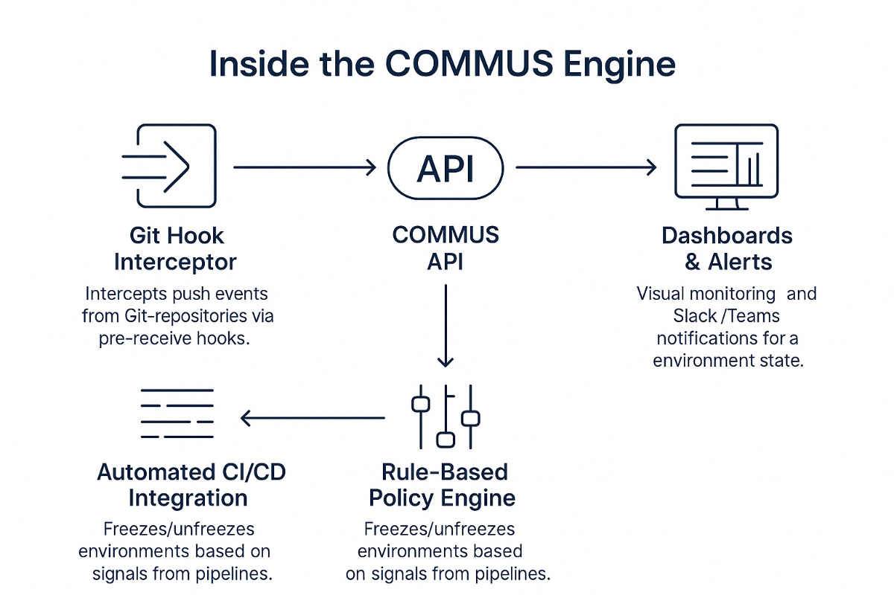

# COMMUS – Smart SDLC Coordination Platform



> **Built by engineers, for engineering teams — COMMUS turns process friction into flow.**

---

## ✨ What is COMMUS?
COMMUS is an enterprise-grade platform that eliminates chaotic chat-based coordination in software projects. By enforcing **branch freeze / unfreeze rules** at the Git layer, it gives QA and Dev teams full control over multi-environment release workflows.

- **Prevent accidental pushes** to critical environments with one click.
- **Multi-VCS support:** Bitbucket, GitLab and GitHub (self-hosted).
- **REST & Webhook API** for seamless CI/CD integration.
- **Role-based access** and **real-time dashboards** for total visibility.

## 🚀 Live Demo
A live instance is deployed on Vercel → <https://commus-landing-page.vercel.app>

## 🖼 Architecture
See `public/architecture_pro.svg` for the high-level data flow.

```
Developer → Git Repo → Pre-receive Hook → COMMUS API (Policy Engine) → Allow / Deny
                                               ↘ Slack / Teams Alerts
```

## 🏁 Quick Start
```bash
# Clone
git clone https://github.com/<your-org>/commus-landing-page.git
cd commus-landing-page

# Install dependencies
npm install

# Run locally
npm run dev   # http://localhost:3000

# Build for production
npm run build && npm start
```

## 📦 Tech Stack
| Layer            | Technology               |
|------------------|--------------------------|
| Frontend         | Next.js 14, React 18     |
| Styling          | Tailwind CSS 3           |
| Animations       | Framer Motion            |
| Icons            | Lucide React             |

## 🌐 Deploying to Vercel
1. **Import Repo** → Vercel Dashboard → New Project.
2. Framework preset **Next.js** (auto-detected).
3. *Build Command* leave blank (Vercel runs `next build`).
4. Click **Deploy** — done!

## 🤝 Contributing
1. Fork the repo & create your branch: `git checkout -b feature/awesome`
2. Commit your changes: `git commit -m "feat: add awesome feature"`
3. Push to the branch: `git push origin feature/awesome`
4. Open a Pull Request.

## 📄 License
Distributed under the MIT License. See `LICENSE` for more information.

---
Made with ❤️ by COMMUS core team.
